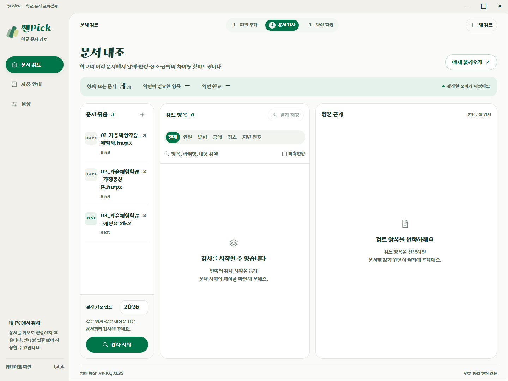
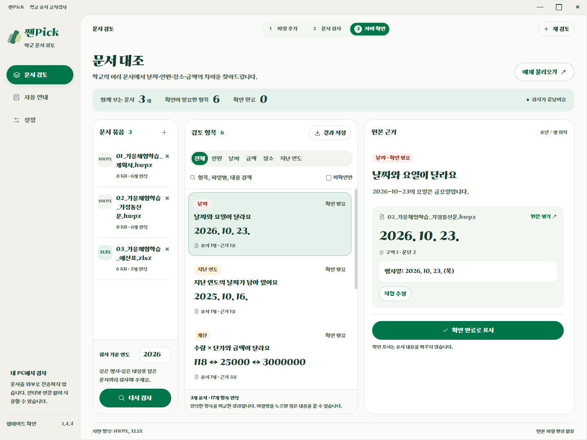
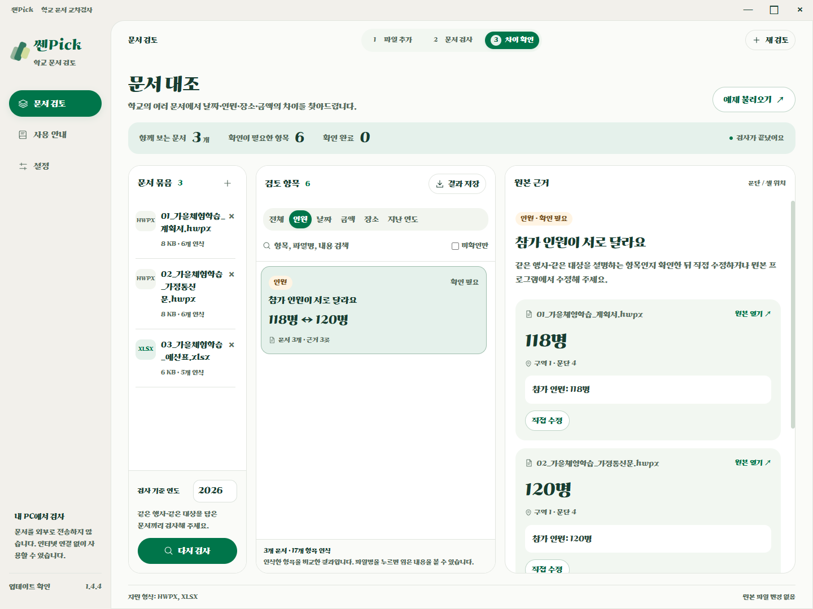
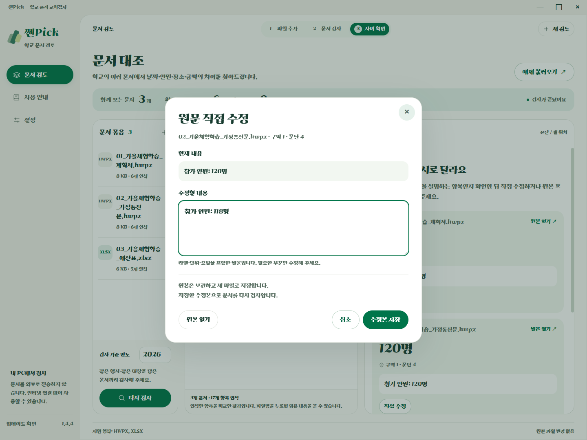
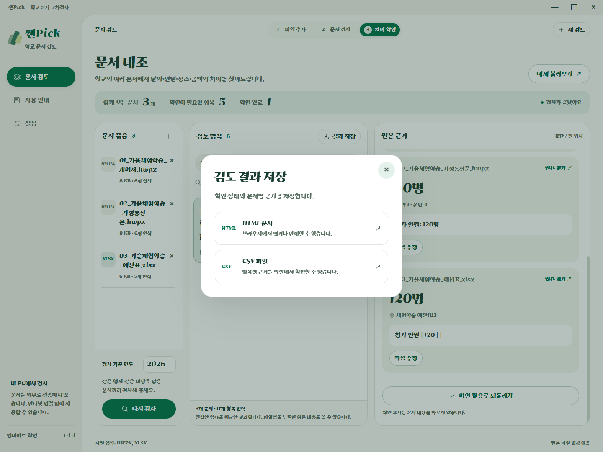

# 쎈Pick

**쎈Pick**은 따뜻한 회백색 바탕에 녹색 버튼과 민트색 강조를 사용합니다. 앱 화면·HTML 검사 결과는 가나초콜릿체, 설치 프로그램은 프리텐다드로 구성했습니다.

학교의 여러 문서에서 날짜·인원·장소·금액의 차이를 찾아드립니다.

기존 **모아검토·SEN콕**의 새 이름입니다. 기존 설치 및 업데이트 연결을 위해 저장소와 실행·배포 파일의 `moa-review` / `MoaReview` 식별자는 유지합니다.

학교의 HWPX·XLSX 파일에서 서로 다른 날짜·인원·장소·금액을 찾아, 원본 근거와 함께 보여주는 Windows 데스크톱 앱입니다. 파일을 불러와 문서 사이의 불일치와 원문 위치를 확인할 수 있습니다.

## 예제로 살펴보기

여러 문서에 반복해서 적은 일정과 숫자, 서로 맞는지 확인해 보세요. **쎈Pick**은 인식한 값의 차이를 모아 보여주고, 해당 문단이나 셀까지 확인할 수 있게 도와줍니다. 문서 검사는 인터넷 연결과 로그인 없이 내 PC에서 진행합니다.

아래는 앱에 포함된 가상의 체험학습 예제를 실제로 검사한 화면입니다. 예제에는 확인 항목 6개를 의도적으로 넣었습니다. 계획서·가정통신문·예산표는 체험용 예시이며, 같은 행사나 대상을 다룬 다른 HWPX·XLSX 문서도 인식 범위 안에서 검사할 수 있습니다.

**1. 함께 확인할 문서를 추가합니다.**

파일을 선택하거나 끌어다 놓으세요. 예제 불러오기로 바로 체험할 수도 있습니다.



**2. 문서 사이의 차이를 한곳에서 확인합니다.**

날짜·인원·장소·금액의 차이와 날짜·요일, 금액 계산의 확인 항목을 보여줍니다.



**3. 118명과 120명, 어디에 다르게 적혔는지 살펴봅니다.**

인원 필터를 선택하면 문서별 값과 원문, 문단·표·셀 위치가 함께 나옵니다. 올바른 값은 원본을 확인한 뒤 사용자가 판단합니다.



**4. 확인한 내용을 직접 수정합니다.**

지원하는 문단·입력 셀은 앱에서 고칠 수 있습니다. 수정본은 새 파일로 저장하고 다시 검사합니다. 아래는 예제의 참가 인원을 118명으로 입력한 저장 전 화면입니다.



**5. 검토 결과를 저장합니다.**

확인 상태와 근거를 HTML 또는 CSV로 보관할 수 있습니다. ‘확인 완료’ 표시는 검토 상태이며 원본 수정 완료를 뜻하지 않습니다.



명시적인 항목명과 표 머리글을 중심으로 검사합니다. **확인 항목이 0개여도 문서 전체의 정확성을 보장하지는 않습니다.** 지원 형식과 인식 범위는 아래 안내를 참고하세요.

## 실행

- [최신 릴리즈 다운로드](https://github.com/HooniKims/moa-review/releases/latest)
- 설치 파일: `MoaReview-Setup-1.4.4.exe`
- 압축 배포본: `MoaReview-1.4.4-x64.zip` — 전체 압축 해제 후 `MoaReview.exe` 실행
- Windows 10/11 x64용입니다. Node.js, Python, 한글, 엑셀 설치 없이 검사할 수 있습니다. 원본 열기는 해당 형식의 연결 프로그램을 사용합니다.
- 가나초콜릿체와 실행 환경을 포함합니다. 문서 검사에는 인터넷 연결과 로그인이 필요하지 않습니다. 업데이트 확인·다운로드에는 인터넷을 사용합니다.
- 별도 코드 서명 인증서가 없는 로컬 빌드입니다. Windows의 앱 신뢰도 확인이 표시될 수 있습니다.

## 빠른 체험

1. **예제 불러오기**를 누릅니다.
2. 계획서·가정통신문·예산표 3개와 기준 연도 2026을 확인합니다.
3. **검사 시작**을 누릅니다. 의도적으로 넣은 확인 항목 6개가 나옵니다.
4. 인원 필터를 누르면 118명·120명의 차이와 문서별 위치가 나옵니다.
5. **확인 완료로 표시**하고 **결과 저장**에서 HTML 또는 CSV로 저장합니다.

자신의 파일은 **파일 선택하기** 또는 끌어놓기로 추가합니다. 같은 행사·같은 대상을 다루는 파일끼리 검사하세요. **사용 안내 → 체험용 파일 저장**으로 예제를 따로 보관할 수 있습니다.

내용을 바로 고치려면 **원본 근거 → 직접 수정 → 수정본 저장**을 선택하세요. 원본을 보관하고 새 파일로 저장한 뒤 자동으로 다시 검사합니다. [직접 수정 안내와 지원 범위](docs/DIRECT-EDIT.md)를 참고하세요.

## 업데이트

왼쪽 아래 **업데이트 확인**에서 현재 버전과 새 버전을 확인합니다. 설치형은 **업데이트 받기 → 재시작하여 설치**로 진행합니다. 재시작하면 현재 검토 상태가 사라지므로 결과를 먼저 저장하세요. ZIP 배포본은 릴리즈 페이지에서 새 ZIP을 내려받아 전체 압축을 해제합니다. 배포 절차는 [RELEASING.md](./RELEASING.md)를 참고하세요.

사이드바의 **설정**에서도 현재 버전과 업데이트를 확인할 수 있습니다. 설정 하단에는 제작자 **HooniKim**을 표시합니다.

1.4.4에서는 쎈img의 색감을 참고해 회백색 바탕, 흰 문서 패널, 짙은 녹색 버튼과 민트색 선택 표시로 다듬었습니다. 이름은 쎈Pick 그대로 유지합니다. [이전 화면 개편 기록](docs/MUSE-UI.md)을 참고하세요.

## 지원하는 기능

- HWPX 여러 구역의 문단·표 텍스트 및 표 셀 좌표 읽기
- XLSX 여러 시트, 공유 문자열·인라인 문자열, 날짜 서식, 저장된 수식 결과 읽기
- 명시적 라벨을 이용한 날짜·인원·장소·금액 교차검사
- 날짜·요일 불일치, 존재하지 않는 날짜, 지난 연도 날짜 후보 확인
- 표의 수량 × 단가와 금액 대조
- 항목 검색, 종류 필터, 미확인 필터, 확인 완료 표시 및 취소
- 파일별 인식 정보와 근거 문장·문단·셀 위치 확인
- 원본 근거 옆의 **직접 수정**으로 HWPX 문단·표 셀과 XLSX 입력 셀을 편집하고 수정본 저장 후 재검사
- 원본 연결 프로그램에서 열기, HTML·CSV 결과 저장
- 손상 파일·지원하지 않는 형식·읽기 실패 안내와 정상 파일의 계속 검사
- 파일당 50MB, 한 묶음 최대 30개. XML 해제 크기·파일 수·검사 시간 제한

## 지원 범위와 한계

**규칙 기반 검사 시제품**입니다. 모든 학교 양식을 이해하는 범용 AI 문서 분석기는 아닙니다. 명시적인 `참가 인원: 118명`, `행사일: 2026. 10. 23.`, `장소: …`, `총예산: …원` 같은 라벨과 표 머리글을 우선 인식합니다.

- HWP, XLS, PDF, 스캔 이미지, 암호화 문서는 지원하지 않습니다.
- 이미지 속 글자, 복수 일정, 임의 문장에 숨은 정보, 복잡한 병합 표를 모두 해석하지 않습니다.
- 문서 전체 지면을 재현하는 뷰어가 아닙니다. 원본 텍스트와 구조적 위치를 보여줍니다. HWPX 쪽 번호는 계산하지 않습니다.
- 엑셀 수식을 실행하지 않습니다. 저장된 계산 결과를 사용하므로 엑셀에서 재계산·저장한 파일을 넣으세요.
- **불일치 0개가 전체 문서의 정확성을 보장하지 않습니다.** 인식한 항목 수와 읽기 안내를 확인하세요.
- 직접 수정은 새 파일로 저장하며 원본과 기존 파일을 덮어쓰지 않습니다. 확인 표시는 검토 상태이며 수정 완료 표시가 아닙니다.
- HWPX의 필드·개체가 있는 문단과 중첩 표를 포함한 바깥 셀, XLSX 수식·배열 수식·보호된 셀은 원본 프로그램에서 수정합니다. HWPX 문단 수는 유지해야 합니다.
- XLSX 입력값을 수정하면 기존 수식의 계산 결과를 비웁니다. 수정본을 엑셀에서 재계산·저장한 뒤 다시 검사하세요.
- 글자 서식과 표 구조를 보존하지만, 글자 길이에 따른 줄·쪽 배치는 한글에서 최종 확인하세요.
- 수정할 값은 사용자가 직접 입력합니다. 편집과 저장에 AI·외부 서버를 사용하지 않습니다.
- 앱 종료 시 검토 상태는 사라집니다. 필요한 결과는 내보내기로 보관하세요.

## 개발과 테스트

Node.js 24 이상을 권장합니다.

```powershell
npm ci
npm start
npm test
npm run test:ui
npm run dist
```

`test:ui`는 실제 Electron 앱을 실행해 화면과 파일 입출력을 확인합니다. 테스트 창은 포커스를 가져오지 않고 표시하며 스크린샷은 `docs/`에 남깁니다. 설치된 실행 파일로 검증하려면:

```powershell
$env:MOA_PACKAGED_EXE = Join-Path $env:LOCALAPPDATA 'Programs/MoaReview/MoaReview.exe'
npm run test:ui
Remove-Item Env:MOA_PACKAGED_EXE
```

핵심 테스트: 정상·오류 문서 비교, 대상 구분, 윤년·요일, 여러 구역·중첩 표·셀 좌표, 엑셀 문자열·날짜·수식, 손상 ZIP·XML, 압축 크기 제한, 내보내기 이스케이프, 원본 불변성.

UI 테스트: 폰트 로딩, 파일 선택·취소, 실제 디스크 파일 끌어놓기, 예제 검사·저장, 검색·필터 및 재검사, 근거 확인, 확인 상태, HTML·CSV 실제 저장, 읽기 실패 안내 내보내기, 작은 창, 기준 연도 오류 복구, 원본 열기 경로, 저장 실패·취소, 원본 덮어쓰기 방지, 초기화.

## 구조

| 경로 | 역할 |
| --- | --- |
| `app/main.cjs` | Windows 창, 파일 선택·내보내기, 제한된 IPC |
| `app/preload.cjs` | 화면에 필요한 기능만 노출 |
| `app/worker.cjs` | 별도 스레드에서 파일 읽기·검사 |
| `app/edit-worker.cjs` | 별도 스레드에서 수정 위치 확인·수정본 생성 |
| `app/index.html`, `styles.css`, `renderer.js` | 프리텐다드 기반 화면과 사용자 흐름 |
| `src/documents.cjs` | ZIP/XML 기반 HWPX·XLSX 읽기 |
| `src/document-edit.cjs`, `src/edit-storage.cjs` | 선택한 원문 수정·검증·새 파일 저장 |
| `src/analyzer.cjs` | 정보 추출·정규화·불일치 검사 |
| `src/report.cjs` | HTML·CSV 결과 생성 |
| `assets/samples/` | 개인정보 없는 가상 행사 예제 |
| `tests/` | 핵심 기능 및 실제 앱 테스트 |
| `docs/UPDATE-VERIFICATION.md` | 설치·업데이트 검증 결과와 남은 한계 |

## 데이터와 라이선스

쎈Pick 앱과 HTML 검사 결과에는 롯데웰푸드의 가나초콜릿체를 포함합니다. MIT·SIL OFL과 별개의 자체 이용 조건을 따르며, 출처와 조건은 [가나초콜릿체 안내](assets/Ghanachocolate-NOTICE.txt)에 기록했습니다. CSV는 서식을 저장하지 않는 형식이므로 여는 프로그램의 글꼴 설정을 따릅니다.

문서 내용은 로컬에서 처리하며 화면의 HTTP·HTTPS·WebSocket 요청을 차단합니다. 업데이트는 메인 프로세스의 별도 네트워크 경로로 확인하며 문서 내용을 전송하지 않습니다. 분석은 메모리에서 수행하고, 결과 저장은 사용자가 선택한 경로에만 합니다. Electron의 일반 사용자 데이터 폴더에는 앱 환경·캐시가 생성될 수 있습니다.

프리텐다드는 SIL Open Font License로 앱에 포함했습니다. 라이선스는 `assets/Pretendard-LICENSE.txt`입니다. 앱 아이콘은 이 프로젝트에서 제작했습니다. Electron 배포 라이선스는 배포 폴더의 `LICENSE*` 파일에 포함됩니다.

기술 확인에 사용한 공식 문서: [Electron 보안](https://www.electronjs.org/docs/latest/tutorial/security), [한컴 HWPX 구조](https://tech.hancom.com/hwpxformat/), [Playwright Electron](https://playwright.dev/docs/api/class-electron), [NSIS 패키징](https://www.electron.build/docs/nsis/), [Pretendard](https://github.com/orioncactus/pretendard).
